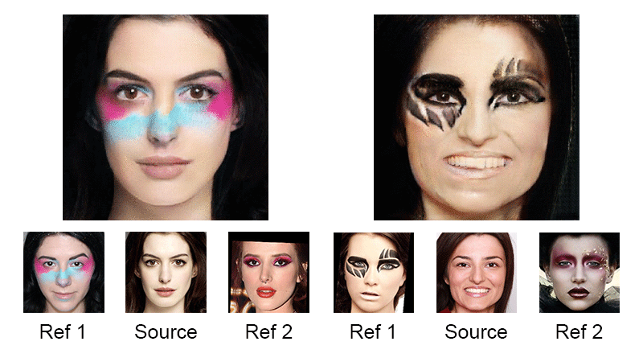

# LADN: Local Adversarial Disentangling Network for Facial Makeup and De-Makeup

[[Project Page]](https://georgegu1997.github.io/LADN-project-page/)[[Paper]](https://arxiv.org/abs/1904.11272)

Pytorch implementation of our network, LADN for makeup transfer and removal. LADN achieve not only state-of-the-art results on conventional styles but also novel results involving complex and dramatic styles with high-frequency details covering large areas across multiple facial features. We also collect a dataset containing unpaired images of before- and after-makeup faces.

Contact: Qiao Gu (qgu@connect.ust.hk) and Guanzhi Wang (gwangaj@connect.ust.hk)

## Paper

LADN: Local Adversarial Disentangling Network for Facial Makeup and De-Makeup <br>
[Qiao Gu](https://georgegu1997.github.io/)\*, [Guanzhi Wang](https://wangguanzhi.github.io/)\*, [Mang Tik Chiu](https://www.linkedin.com/in/mtchiu/), [Yu-Wing Tai](https://scholar.google.com/citations?user=nFhLmFkAAAAJ&hl=en), [Chi-Keung Tang](http://www.cse.ust.hk/~cktang/) <br>
arXiv preprint arXiv:1904.11272 (\*Equal contribution. Authorship order was determined by rolling dice.)

Please cite our paper if you find the code or dataset useful for your research.

```
@article{DBLP:LADN,
  author    = {Qiao Gu and Guanzhi Wang and Mang Tik Chiu and Yu{-}Wing Tai and Chi{-}Keung Tang},
  title     = {{LADN:} Local Adversarial Disentangling Network for Facial Makeup and De-Makeup},
  journal   = {arXiv},
  volume    = {abs/1904.11272},
  year      = {2019},
  url       = {http://arxiv.org/abs/1904.11272},
}
```

## Usage

### Install

* Clone this repo.

```
git clone https://github.com/wangguanzhi/LADN.git
```

### Install required packages

We recommend installing the required package using [Anaconda](https://www.anaconda.com/distribution/).

```
cd LADN
conda create -n makeup-train python=3.6
source activate makeup-train
```

Please install [PyTorch](https://pytorch.org/get-started/locally/) according to your hardware configuration. (This implementation has been tested on Ubuntu 16.04, CUDA 9.0 and CuDNN 7.5) Then install the following packages.

```
conda install requests
conda install -c conda-forge tensorboardx
```

### Download makeup dataset

* We release a dataset containing unpaired images before- and after-makeup faces, together with the synthetic ground truth.
* Our code uses Face++ Detection API for facial landmarks, and the downloaded dataset includes the facial landmarks of the dataset images.

Please download the zipped dataset from [Google Drive](https://drive.google.com/open?id=1gygDQarCOZ7E4qptvTyYF_iZNxsJ4WnI), put it in the `LADN/datasets/` and unzip it.

### Training

* Please change `CUDA_VISIBLE_DEVICES` and `--name makeup` accordingly. If the memory of one GPU is not enough for the training, please set the `--backup_gpu` to another available GPU ID.
* The pre-detected landmarks is included in the provided dataset as a pickle file. It is loaded and used for training by default option.

Scripts for activate required venv and initiate a standard training.

```
cd src
source activate makeup-train
CUDA_DEVICE_ORDER=PCI_BUS_ID CUDA_VISIBLE_DEVICES=0,1 python3 run.py --backup_gpu 1 --dataroot ../datasets/makeup --name makeup --resize_size 576 --crop_size 512 --local_style_dis --n_local 12 --local_laplacian_loss --local_smooth_loss
```

### Download and run pre-trained models

* We release two pre-trained models (*light.pth* and *extreme.pth*) for your reference.
* [light.pth](https://drive.google.com/open?id=17si9Eu1HFKEvDGNgiT2WGzqELIiy5oXl) performs better on light/conventional makeup styles.
* [extreme.pth](https://drive.google.com/open?id=1ToQcUZXCcpkN3jWCavIegHVF4I4OuCGJ) performs better on extreme/highly dramatic makeup styles.

Please download the pre-trained model file and put it in `model` folder. and run the following command to test the model.

For *light.pth*

```
CUDA_DEVICE_ORDER=PCI_BUS_ID CUDA_VISIBLE_DEVICES=0,1 python3 run.py --backup_gpu 1 --dataroot ../datasets/makeup --name makeup_test --resize_size 576 --crop_size 512 --local_style_dis --n_local 12 --phase test --test_forward --test_random --result_dir ../results --test_size 300 --resume ../models/light.pth --no_extreme
```

For *extreme.pth*

```
CUDA_DEVICE_ORDER=PCI_BUS_ID CUDA_VISIBLE_DEVICES=0,1 python3 run.py --backup_gpu 1 --dataroot ../datasets/makeup --name makeup_test --resize_size 576 --crop_size 512 --local_style_dis --n_local 12 --phase test --test_forward --test_random --result_dir ../results --test_size 300 --resume ../models/extreme.pth --extreme_only
```

## Acknowledgement

Our code is inspired by [DRIT](https://github.com/HsinYingLee/DRIT) and [DeepHDR](https://github.com/elliottwu/DeepHDR)
